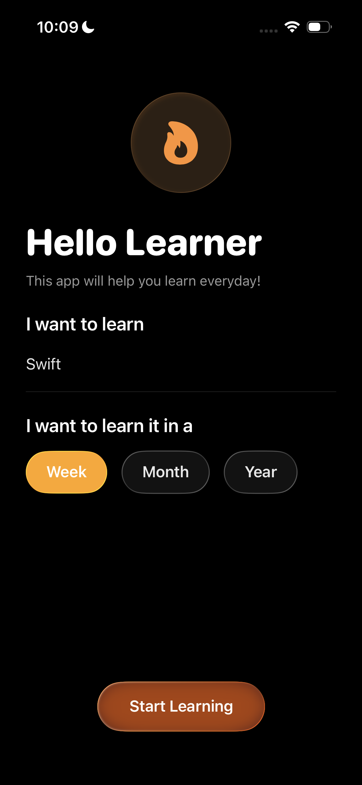

# 🌱 Learning Journey App

**Designed & Developed by Deemah Alhazmi**  
☕ Fueled by creativity, SwiftUI, and a good cup of coffee  

---

## 🍎 About This Project

This project was created as part of my **second challenge at the Apple Developer Academy**.  
The **design was provided** by our team, and I was responsible for the **development and coding** of the app using **SwiftUI** and the **MVVM architecture**.

---

## 📱 App Preview

Here’s a glimpse into **Learning Journey** 👇  

| Onboarding | Activity Page | Learning Goal | Calendar |
|-------------|----------------|----------------|------------|
|  |  |  |  |

> 💡 Tip: Place your screenshots inside a folder named **images** in your project root,  
> and rename them like `onboarding.png`, `activity.png`, etc.

---

## 🎯 What is Learning Journey?

**Learning Journey** helps users stay consistent with their personal learning goals —  
encouraging daily progress and reflection through simple, gamified tracking.

You can:
- Set a learning goal (e.g., "Learn Swift")
- Choose your plan (week, month, or year)
- Log each day as **Learned** or **Frozen (Rest)**
- View your overall progress in a beautiful calendar

---

## 🪄 How It Works

### 🧩 Step 1: Start Learning
1. **Onboarding** → Enter your goal and duration  
2. **Activity Page** → Start tracking your learning journey

---

### ✍️ Step 2: Log Your Progress  
- ✅ **Learned Today** → Marks the day in **orange** (progress made)  
- 🧊 **Freeze Day** → Marks the day in **teal** (rest day taken)

---

### 🔁 Step 3: Update or Change Your Goal  
If you complete or wish to modify your goal:
- Tap the **Learning Goal icon**
- Update your topic or duration  
- Confirm changes (your streak resets for a fresh start!)

---

### 📅 Step 4: View Your Calendar  
See your full progress across days, weeks, and months.  
Scroll through your calendar to reflect on how far you’ve come.

---

## 🧠 Architecture

| Layer | Description |
|-------|--------------|
| **Model** | Handles data like goals, plans, and daily logs |
| **View** | Displays app screens (Onboarding, Activity, Goal, Calendar) |
| **ViewModel** | Connects the data and logic between Model and View |

---

## 🛠️ Technologies Used
- **SwiftUI 5** → Modern, declarative UI framework  
- **Combine** → Reactive event handling  
- **MVVM** → Clean and organized architecture  
- **@AppStorage** → Local data persistence  

---

## 💡 Future Enhancements
- Daily reminder notifications  
- Achievement badges for streaks  
- Progress sharing with friends  

---

### 👩🏻‍💻 About the Developer
Hi! I’m **Deemah Alhazmi**, an iOS Developer and designer at the Apple Developer Academy.  
I’m passionate about building apps that blend creativity, simplicity, and purpose.  
When I’m not coding, you’ll probably find me sketching or enjoying a good cup of coffee ☕✨  

---

> _“Consistency turns learning into growth — one day at a time.”_
